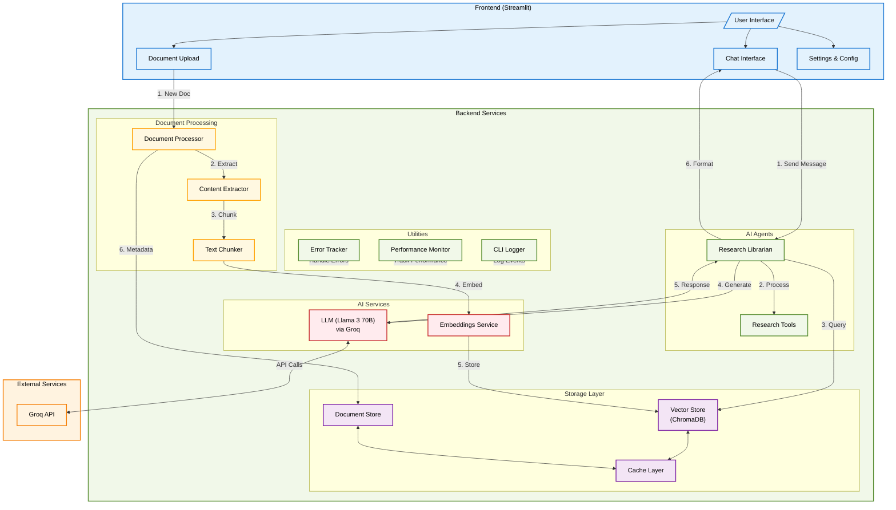

# ARK AI | Academic Research Knowledgebase


> ⚠️ **Alpha Release**: This software is in active development. Features and APIs may change without notice.

A robust research assistant and intelligent semantic knowledge base repository for the academic study of consciousness, inspired by the Bhaktivedanta Institute.

## ✨ Features

### 🤖 Core Capabilities

- Advanced AI-powered research assistant using Llama 3 70B model
- Semantic knowledge base for consciousness studies
- Intelligent document search and analysis
- Interactive chat interface with citation support
- Document management system
- Real-time processing and responses
- Academic-focused research tools
- Beautiful terminal interface with contextual emojis

### 📚 Document Processing

- Intelligent PDF processing and text extraction
- Smart document chunking with citation preservation
- Comprehensive metadata extraction
- Page-level content tracking
- Multi-format document support

### 🔍 Search & Retrieval

- Advanced semantic search with ChromaDB
- Hybrid search capabilities (semantic + keyword)
- Metadata filtering and faceted search
- Relevance scoring and ranking
- Batch processing support
- Asynchronous processing for better performance

### 📝 Citation System

- Robust source verification and citation tracking
- Wikipedia-style reference management
- Page-level citation linking
- Citation export in multiple academic formats
- Source integrity verification
- Citation network visualization

### 📊 Performance & Monitoring

- Enhanced CLI logging with contextual emojis
- Rich terminal output with color-coding
- Performance monitoring and metrics
- Error tracking and handling
- System health monitoring
- Resource usage optimization
- Asynchronous operations support

## 🚀 Quick Start

### Prerequisites

- Python 3.9 or higher
- Git
- Virtual environment (recommended)
- Groq API key for LLM access

### Installation

1. Clone the repository and create a virtual environment:

```bash
git clone https://github.com/yourusername/ark-ai.git
cd ark-ai
python -m venv venv
source venv/bin/activate  # Linux/Mac
# or
.\venv\Scripts\activate  # Windows
```

1. Install dependencies:

```bash
pip install -r requirements.txt
```

1. Set up environment variables:
Create a `.env` file in the project root with:

```env
# LLM API Configuration
GROQ_API_KEY=your_groq_api_key

# Model Configuration
MODEL_NAME=llama3-groq-70b-8192-tool-use-preview
MODEL_TEMPERATURE=0.7
MODEL_MAX_TOKENS=8192

# Database Configuration (Optional)
POSTGRES_USER=your_postgres_user
POSTGRES_PASSWORD=your_postgres_password
POSTGRES_DB=your_database_name
POSTGRES_HOST=your_host
POSTGRES_PORT=your_port
```

1. Run the application:

```bash
streamlit run app/frontend/Home.py
```

1. Access the application at `http://localhost:8501`

## 📁 Project Structure

```curl
ark-ai/
├── app/
│   ├── backend/
│   │   ├── agents/          # AI agents and LLM integration
│   │   ├── api/            # FastAPI endpoints
│   │   ├── processing/     # Document processing pipeline
│   │   ├── vector_store/   # Vector storage implementation
│   │   └── models.py       # Data models
│   ├── frontend/
│   │   ├── Home.py        # Main application entry
│   │   └── pages/         # Additional UI pages
│   └── utils/
│       ├── cli_logger.py  # Enhanced terminal logging
│       └── other utils    # Shared utilities
├── data/                  # Data storage
│   ├── vector_store/     # ChromaDB storage
│   └── test_documents/   # Test documents
├── docs/                 # Documentation
├── logs/                 # Application logs
├── tests/               # Test suite
├── .env                # Environment variables
├── requirements.txt    # Python dependencies
└── README.md
```

## 🛠️ Tech Stack

### Core Components

- **Frontend**: Streamlit
- **Backend**: FastAPI, AsyncIO
- **Vector Store**: ChromaDB (with planned migration to PostgreSQL/pgvector)
- **AI/ML**: LangChain, Groq (Llama 3 70B)
- **Document Processing**: PyMuPDF, LangChain
- **Embeddings**: Sentence Transformers
- **CLI**: Rich (terminal formatting)

### Dependencies

- fastapi >= 0.104.0
- streamlit >= 1.28.0
- langchain >= 0.0.350
- chromadb >= 0.4.22
- PyMuPDF >= 1.23.0
- sentence-transformers >= 2.2.2
- python-json-logger >= 2.0.7
- rich >= 13.9.0
- And more in requirements.txt

## 🔧 Development

### Setting Up Development Environment

1. Install development dependencies:

```bash
pip install -r requirements-dev.txt
```

1. Run tests:

```bash
pytest tests/
```

1. Manual testing:

```bash
python tests/manual_test.py
```

### Logging and Monitoring

The application includes comprehensive logging:

- Structured JSON logging
- Performance monitoring
- Error tracking
- Log rotation
- Component-specific logging

### Vector Store

Currently using ChromaDB for vector storage with planned migration to PostgreSQL/pgvector:

- Document storage and retrieval
- Similarity search
- Metadata filtering
- Batch processing

## 🤝 Contributing

1. Fork the repository

1. Create and switch to a new branch:

```bash
git checkout -b feature-branch
```

1. Make changes and commit:

```bash
git add .
git commit -m "Description of changes"
```

1. Push changes:

```bash
git push -u origin feature-branch
```

## 📄 License

This project is licensed under the MIT License - see the LICENSE file for details.

## 🙏 Acknowledgments

Special thanks to the Bhaktivedanta Institute for their support and guidance in developing this research tool for consciousness studies.

## 📝 Changelog

### v0.2.1-alpha (2024-12-16)

- Updated README with latest features, model configuration, and dependencies
- Improved documentation and branding to ARK AI

### v0.2.0-alpha (2024-12-15)

- Added multi-format document processing
- Enhanced logging and monitoring
- Improved error handling
- Updated documentation and branding to ARK AI

### v0.1.0-alpha (Initial Release)

- Basic PDF processing
- ChromaDB integration
- Simple search functionality
- Initial documentation

## 🔄 Application Workflow



### Workflow Description

1. **User Interaction Layer**
   - Users interact with the Streamlit frontend
   - Chat interface handles message processing
   - Document upload interface manages file ingestion

2. **AI Processing Layer**
   - Research Librarian orchestrates AI operations
   - Async message processing with proper error handling
   - Enhanced CLI logging with contextual emojis

3. **Document Processing Pipeline**
   - Intelligent document chunking and extraction
   - Metadata preservation and tracking
   - Embedding generation and storage

4. **Storage Layer**
   - ChromaDB for vector storage
   - Document store for metadata
   - Caching for performance optimization

5. **AI Services**
   - Llama 3 70B model via Groq API
   - Asynchronous API calls
   - Response streaming support

6. **Utility Layer**
   - Rich terminal output with emojis
   - Performance monitoring
   - Error tracking and handling
