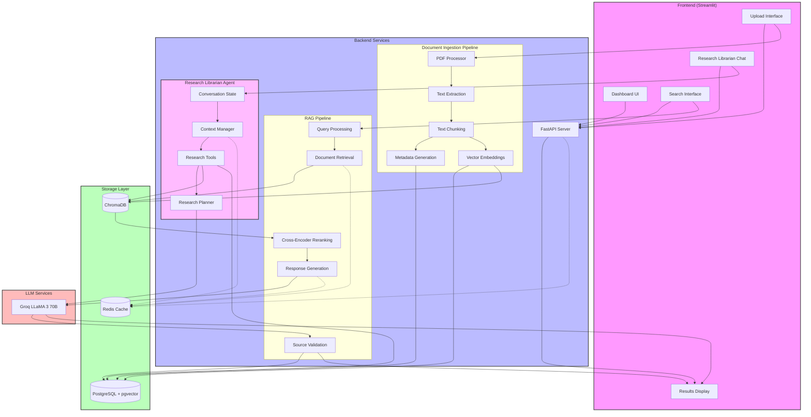

# Research Assistant - Bhaktivedanta Institute

A robust research assistant and intelligent semantic knowledge base repository for the academic study of consciousness, developed for the Bhaktivedanta Institute.

## Features

- Document ingestion and processing of academic papers (~10,000 PDFs and books)
- Advanced semantic search with reasoning, comparison, and summarization
- Accurate, grounded responses with validated citations
- Interactive research-friendly frontend using Streamlit

## Technology Stack

- **Backend:** Python, FastAPI, LangChain, LangGraph, Pydantic, ChromaDB
- **LLM:** Groq LLaMA 3 70B
- **Storage:** PostgreSQL with pgvector for vector embeddings
- **Frontend:** Streamlit
- **Infrastructure:** Docker, Kubernetes, Redis

## Getting Started

### Prerequisites

- Python 3.8 or higher
- PostgreSQL with pgvector extension
- Docker (optional)
- Groq API key

### Installation

1. Clone the repository:

```bash
git clone <repository-url>
cd research-assistant
```

1. Create and activate virtual environment:

```bash
python -m venv venv
.\venv\Scripts\activate  # Windows
source venv/bin/activate  # Linux/Mac
```

1. Install dependencies:

```bash
pip install -r requirements.txt
```

1. Set up environment variables:
Create a `.env` file in the project root with:

```env
POSTGRES_USER=your_user
POSTGRES_PASSWORD=your_password
POSTGRES_HOST=localhost
POSTGRES_PORT=5432
POSTGRES_DB=research_assistant
GROQ_API_KEY=your_groq_api_key
```

### Running the Application

1. Start the Streamlit app:

```bash
streamlit run app/frontend/Home.py
```

1. Access the application at `http://localhost:8501`

## Project Structure

```curl
research_assistant/
├── app/
│   ├── backend/
│   │   ├── ingestion/
│   │   ├── rag/
│   │   └── api/
│   ├── frontend/
│   │   └── pages/
│   └── utils/
├── tests/
├── docs/
└── docker/
```

## Development

### Git Workflow

1. Initialize repository:

```bash
git init
```

1. Create and switch to a new branch:

```bash
git checkout -b feature-branch
```

1. Make changes and commit:

```bash
git add .
git commit -m "Description of changes"
```

1. Push changes:

```bash
git push -u origin feature-branch
```

### Running Tests

```bash
pytest
```

## Features in Detail

1. **Document Processing**
   - PDF parsing and text extraction
   - Semantic chunking
   - Metadata extraction and storage
   - Vector embeddings generation

2. **Search Capabilities**
   - Semantic search
   - Document comparison
   - Summary generation
   - Deep analysis

3. **User Interface**
   - Document upload with metadata input
   - Advanced search interface
   - Results visualization
   - Dashboard with statistics

## Application Workflow



## Contributing

1. Fork the repository
2. Create your feature branch
3. Commit your changes
4. Push to the branch
5. Create a Pull Request

## License

[Add License Information]

## Acknowledgments

- [Add other acknowledgments]
