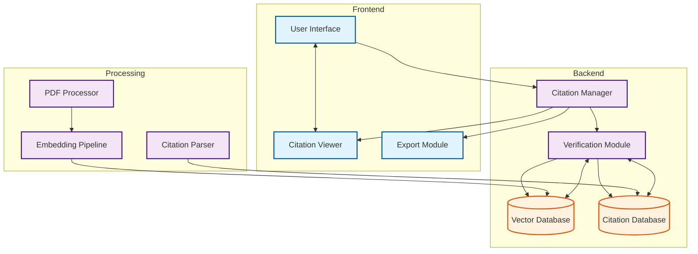

# 🎓 Research Assistant - Bhaktivedanta Institute

A robust research assistant and intelligent semantic knowledge base repository for the academic study of consciousness, developed for the Bhaktivedanta Institute.

## ✨ Features

- 🤖 Advanced AI-powered research assistant
- 📚 Semantic knowledge base for consciousness studies
- 📝 Academic Citation System:
  - Robust source verification and citation tracking
  - Wikipedia-style reference management
  - Page-level citation linking
  - Citation export in multiple academic formats
  - Source integrity verification
- 🔍 Intelligent document search and analysis
- 💬 Interactive chat interface with citation support
- 📊 Document management system
- 🔄 Real-time processing and responses
- 🎯 Academic-focused research tools

## 🎯 Citation System

The Research Assistant implements a comprehensive academic citation system designed to maintain the highest standards of academic integrity:

- **Source Verification**: Every response is grounded in verified source documents with precise page-level citations
- **Citation Tracking**: Maintains a detailed history of citations and their usage context
- **Reference Management**: Wikipedia-style reference numbering and formatting
- **Export Formats**: Citations can be exported in various academic formats (APA, MLA, Chicago, etc.)
- **Integrity Checks**: Automated verification of source material against citations
- **Citation Links**: Direct links to source documents and specific page references
- **Citation Networks**: Visualization of interconnected sources and citations

### System Architecture



## 🚀 Quick Start

1. Clone the repository and create a virtual environment:

```bash
python -m venv venv
source venv/bin/activate  # Linux/Mac
# or
.\venv\Scripts\activate  # Windows
```

1. Install dependencies:

```bash
pip install -r requirements.txt
```

1. Set up environment variables:
Create a `.env` file in the project root with:

```env
# API Keys
GROQ_API_KEY=your_groq_api_key
OPENAI_API_KEY=your_openai_api_key

# Database Configuration
POSTGRES_USER=your_postgres_user
POSTGRES_PASSWORD=your_postgres_password
POSTGRES_DB=your_database_name
POSTGRES_HOST=your_host
POSTGRES_PORT=your_port

# Redis Configuration
REDIS_HOST=your_redis_host
REDIS_PORT=your_redis_port
REDIS_PASSWORD=your_redis_password
```

1. Run the application:

```bash
streamlit run app/frontend/Home.py
```

1. Access the application at `http://localhost:8501`

## 📁 Project Structure

```curl
research-assistant/
├── app/
│   ├── backend/         # API and server-side logic
│   ├── frontend/        # Streamlit UI components
│   │   ├── Home.py     # Main application entry
│   │   └── pages/      # Additional UI pages
│   └── utils/          # Shared utilities
├── docs/               # Documentation
├── tests/              # Test suite
├── .env               # Environment variables
├── requirements.txt    # Python dependencies
└── README.md
```

## 🛠️ Tech Stack

- **Frontend**: Streamlit
- **Backend**: FastAPI
- **AI/ML**: LangChain, Groq
- **Database**: PostgreSQL (with pgvector)
- **Caching**: Redis
- **Dependencies**:
  - fastapi >= 0.104.0
  - streamlit >= 1.28.0
  - langchain >= 0.0.350
  - chromadb >= 0.4.22
  - pandas >= 2.1.3
  - And more in requirements.txt

## 🤝 Contributing

1. Fork the repository

1. Create and switch to a new branch:

```bash
git checkout -b feature-branch
```

1. Make changes and commit:

```bash
git add .
git commit -m "Description of changes"
```

1. Push changes:

```bash
git push -u origin feature-branch
```

## 📄 License

This project is licensed under the MIT License - see the LICENSE file for details.

## 🙏 Acknowledgments

- 🏛️ Bhaktivedanta Institute
- [Add other acknowledgments]
